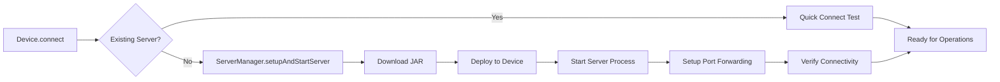

# SwiftClicker Development Guide

## Quick Start for Future Agents

### Project Context
- **Status**: Production-ready Swift uiautomator2 client
- **Functionality**: Complete touch and key input automation for Android
- **Testing**: Successfully tested with real Android emulator
- **Architecture**: Full server lifecycle management with robust error handling

### Essential Files to Understand
1. **`CLAUDE.md`** - Complete technical context and architecture
2. **`Sources/SwiftClicker/Device.swift`** - Main user API
3. **`Sources/SwiftClicker/ServerManager.swift`** - Server lifecycle management
4. **`Sources/SwiftClickerDemo/main.swift`** - Working example of all features

## Development Environment Setup

### Prerequisites
```bash
# Verify Swift toolchain
swift --version  # Requires 5.9+

# Verify Android development setup
adb devices      # Should show connected device/emulator

# Test network connectivity (for JAR download)
curl -I https://github.com/openatx/uiautomator2/releases/download/3.4.2/u2.jar
```

### Quick Build & Test
```bash
# Build everything
swift build

# Run comprehensive demo (tests all functionality)
swift run SwiftClickerDemo

# Run unit tests
swift test
```

## Common Development Tasks

### 1. Adding New Input Methods

**Pattern**: Follow existing touch/key event implementations

```swift
// In Device.swift
public func newInputMethod(param: Type) async throws {
    try ensureConnected()
    
    do {
        _ = try await httpClient.jsonrpcCall(
            method: "newMethodName", 
            params: [param]
        )
    } catch let HTTPClientError.jsonrpcError(message) {
        throw DeviceError.serverError(message)
    }
}
```

**Testing**: Add to demo application for immediate verification

### 2. Debugging Connection Issues

**Diagnostic Steps**:
```bash
# 1. Check device connectivity
adb devices

# 2. Test server manually
curl http://127.0.0.1:9008/ping

# 3. Check port forwarding
adb forward --list

# 4. Check server process on device  
adb shell ps | grep uiautomator

# 5. Manual server restart
adb shell pkill -f uiautomator
# Then run SwiftClickerDemo again
```

**Code Debugging**: Enable verbose logging in `HTTPClient.ping()` method

### 3. Extending Server Management

**Current**: Downloads from GitHub releases
**Extension Points**:
- Local JAR file support
- Multiple server versions
- Custom server configurations

**Location**: `Sources/SwiftClicker/ServerManager.swift`

### 4. Multi-Device Support

**Current**: Single device per `Device` instance
**Usage**:
```swift
let device1 = Device(deviceSerial: "emulator-5554")
let device2 = Device(deviceSerial: "emulator-5556")
```

**Extension**: Device pool management, concurrent operations

## Architecture Deep Dive

### Server Lifecycle (Critical Understanding)



**Key Insight**: uiautomator2 requires active server process on device, not just installed APK

### Error Handling Strategy

**Layered Approach**:
1. **Network Level**: `HTTPClientError` for connectivity issues
2. **Server Level**: `ServerError` for deployment/startup issues  
3. **Device Level**: `DeviceError` for operation failures
4. **User Level**: Detailed troubleshooting instructions

### JSON-RPC Communication

**Critical Methods**:
- `injectInputEvent(action, x, y, pointer)` - All touch events
- `pressKey(keyName)` / `pressKeyCode(code)` - Key events
- `deviceInfo()` - Lightweight connectivity test
- `dumpWindowHierarchy()` - UI analysis (future enhancement)

## Testing Strategy

### Current Test Coverage
- ✅ **Unit Tests**: Basic functionality verification
- ✅ **Integration Demo**: Complete end-to-end testing
- ✅ **Real Device**: Tested with Android emulator

### Test Development Pattern
1. **Add to Demo**: New features immediately get demo integration
2. **Unit Test**: Basic functionality verification
3. **Error Cases**: Test failure scenarios
4. **Documentation**: Update README/CLAUDE.md

### Manual Testing Checklist
```bash
# 1. Clean environment test
rm -rf .build && swift run SwiftClickerDemo

# 2. Multiple runs (server reuse test)
swift run SwiftClickerDemo && swift run SwiftClickerDemo

# 3. Error scenarios
# - Disconnect device mid-operation
# - Network connectivity issues
# - Server port conflicts
```

## Extension Opportunities

### High-Value Additions
1. **UI Element Finding**: XPath/CSS selectors for element interaction
2. **Screenshot Capture**: Visual verification and analysis
3. **Gesture Recording**: Record and replay complex gesture sequences
4. **App Management**: Install, launch, manage applications
5. **Performance Monitoring**: FPS, memory, network monitoring

### Implementation Guidance
- **Follow existing patterns**: Use Device → HTTPClient → JSON-RPC flow
- **Maintain server management**: Leverage existing ServerManager
- **Add to demo**: Immediately testable implementations
- **Update documentation**: Keep CLAUDE.md current

## Troubleshooting Guide

### Common Issues

**"Connection Failed"**
- Check `adb devices` output
- Verify emulator/device accessibility
- Test manual curl to ping endpoint

**"JAR Deployment Failed"** 
- Check network connectivity for GitHub download
- Verify device storage space: `adb shell df /data/local/tmp`
- Check ADB permissions for file operations

**"Server Not Ready"**
- Device may need accessibility permissions
- Check for conflicting processes: `adb shell ps | grep uiautomator`
- Try manual server restart

**"JSON-RPC Errors"**
- Server may be overloaded (add delays)
- Check device UI state (locked screen, etc.)
- Verify coordinate ranges match device resolution

### Debug Mode Activation
```swift
// Enable verbose HTTP client logging
// Modify HTTPClient.ping() to add print statements
// Check CLAUDE.md for specific debugging techniques
```

## Performance Considerations

### Optimal Usage Patterns
- **Reuse Device instances**: Connection setup is expensive
- **Batch operations**: Group related touch/key events
- **Proper cleanup**: Always call `device.disconnect()`
- **Error recovery**: Handle server disconnections gracefully

### Resource Management
- **Server process**: ~10-20MB memory on device
- **Network**: Minimal overhead for input events
- **JAR file**: 3.7MB one-time download and deployment

This development guide provides the essential context for maintaining and extending SwiftClicker efficiently.